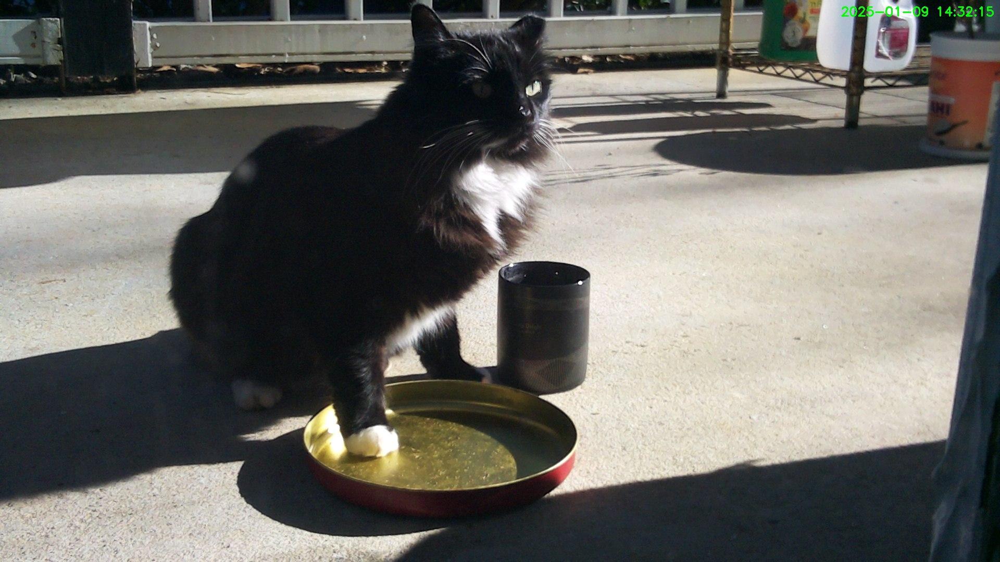
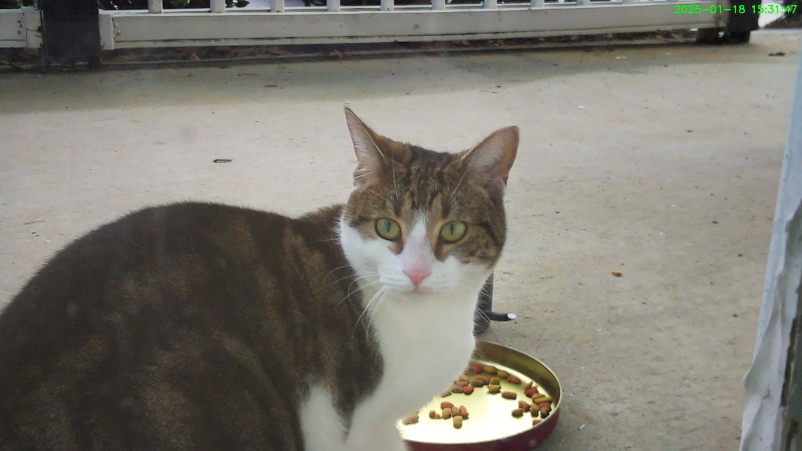
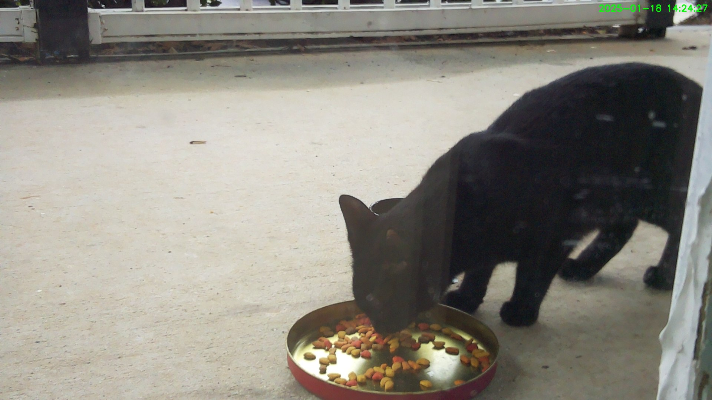
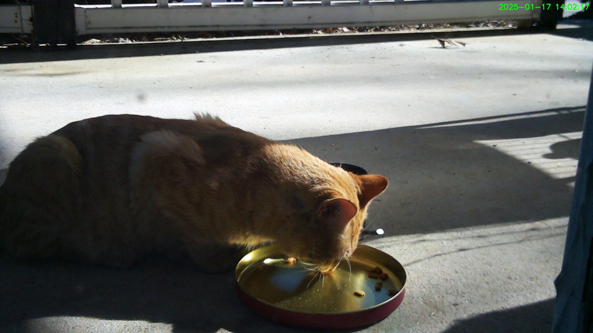
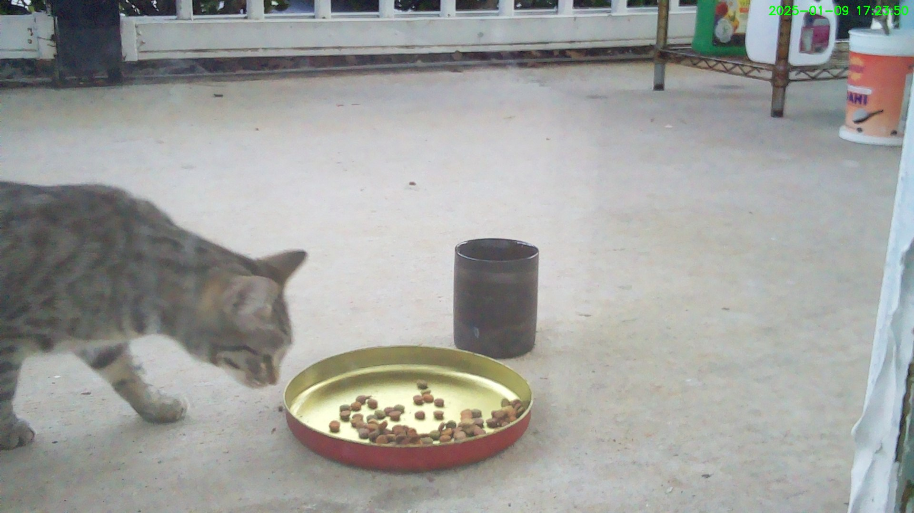
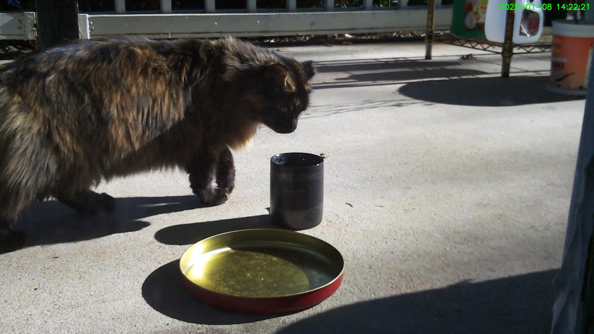

# Automated Stray Cat Monitoring System

This project leverages a **Raspberry Pi** and a camera module to monitor and document stray cats during feeding times. By detecting motion and identifying the presence of cats, the system captures images and uploads them to a **Telegram channel** for convenient access and real-time updates.

## Features
1. **Motion Detection**:
   - Utilizes a motion detection algorithm to detect activity in the camera's field of view.
   - Triggers further processing only when motion surpasses a predefined threshold.

2. **Cat Identification with YOLO**:
   - Runs a **YOLO (You Only Look Once)** object detection model to determine if a cat is present in the captured frame.
   - Ensures the system responds only to relevant events, reducing false positives.

3. **Telegram Integration**:
   - Automatically uploads detected images to a Telegram channel for easy access and sharing.
   - Provides real-time notifications to monitor cat activity remotely.

4. **Automated Photography**:
   - Captures photos of cats during feeding times or upon motion detection.
   - Maintains a log of events for long-term monitoring.

## How It Works
1. The Raspberry Pi camera continuously monitors the feeding area.
2. When motion is detected:
   - The system analyzes the frame using YOLO to verify if a cat is present.
3. If a cat is detected:
   - A photo is captured and uploaded to the configured Telegram channel.
4. Users receive instant updates and can review activity logs via Telegram.

## Requirements
  - Raspberry Pi (with internet connectivity)
  - Raspberry Pi Camera Module

## Installation
1. Clone this repository:
   ```bash
   git clone https://github.com/jerryuhoo/cat_camera.git
   cd cat_camera
   ```
2. Install the required dependencies and virtual environment:
   ```bash
   sudo apt install -y libcamera-dev libcamera-apps libcap-dev
   python3 -m venv --system-site-packages cat
   source cat/bin/activate
   pip install -r requirements.txt
   ```
3. Set up the Telegram Bot:
   - Create a Telegram bot using [BotFather](https://core.telegram.org/bots#botfather).
   - Obtain the bot token and chat id, and then configure them in `cat.py`.

4. Run the project:
   ```bash
   ./run.sh
   ```
## Example Photo
Here is an example of a cat detected and captured by the system:






